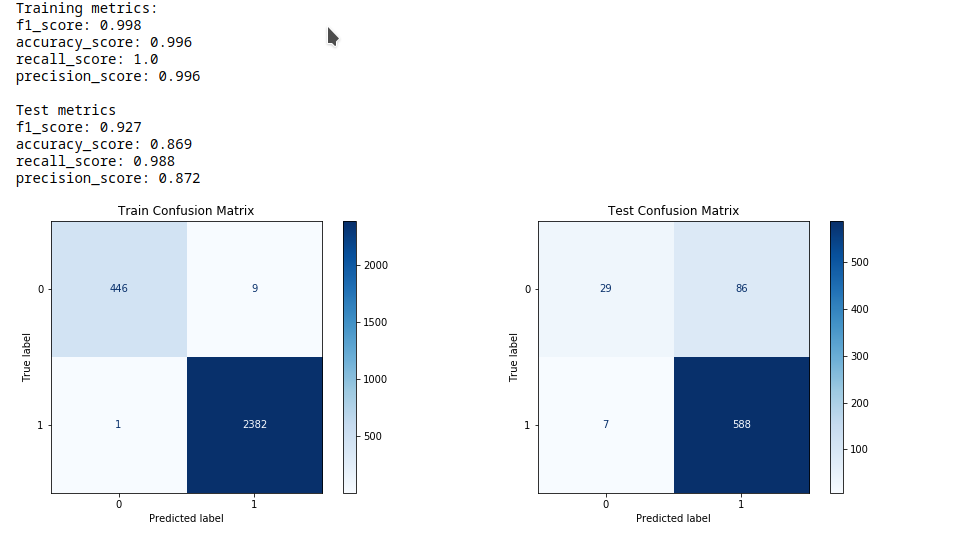
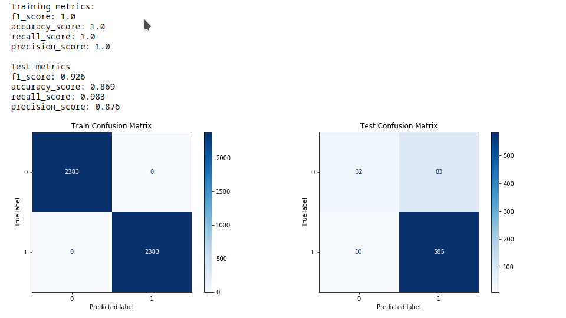
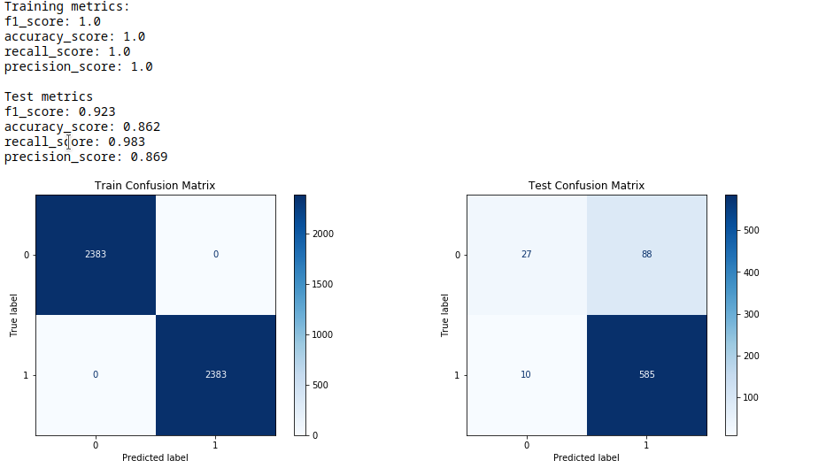

# Module 4 Final Project

## The Goal
The goal of this project was to take raw twitter data, preprocess it, clean it, explore the tweet data using various statistics, and then create a NLP binary classifier with Sklearn.

# My Approach
## Preprocessing data
  * Remove classes to make this a binary classification task
  * Tokenize tweets
  * Remove stopwords

## Exploring Corpus Statistics
  * Total vocabulary size of dataset
  * Normalized word frequency
  * Bigrams
## Modeling the data
  * Vectorize using TF-IDF
  * Train baseline random forest classifier
  
  * **Performance metrics are too high:** These are some pretty high performance metrics (all perfect scores for training, and almost perfect recall in test set), at first glance it seems like everything is going well. Who doesn't love high numbers? But the real issue here is that the model is almost always predicting 1s. Even a terrible model that always predicts 1 will have a perfect recall.
  * **Overfitting:** The random forest classifier is seriously overfit, which we'd expect with a sparse matrix of over 5000 features and no regularization.
  * **Class Imbalance:** We still see that there's a class imbalance problem with our positive labels occuring 6 times as often as the negative labels. In the test set, our model only predicted a negative sentiment 30 out of 595 times or 5% even though the correct portion of negative tweets was closer to 16%. This issue is likely a symptom of the class imbalance present in the training data. The class imbalance issue also contributes to deceiving but very high performance metrics.
# Tuning the model
  ## Resample using SMOTE to fix class imbalance
  
  Bummer. It seems like the class imbalance problem wasn't contributing as much as we thought to the model's behavior of always predicting positive tweet sentiment. Though our model did predict a negative sentiment a tiny bit more. Before we fixed the class imbalance our model only predicted 30 negative sentiments, our new SMOTE model predicted 42. Now that we've addressed the imbalance, let's tune the models hyperparameters to see if we can generalize a bit and reduce the overfitting.
  ## Gridsearch hyperparameters
  
  That's interesting. The best combination of paramaters tended to be an overfit random forest. You can see that the best performing model was the model that allowed the classifier to become as overfit and complex as it could (ie. No max_depth, highest number of estimators at 200, lowest min_samples_leaf).

This leads me to think that we've gotten to the end of the road for our model as it stands. Maybe we could try a different classifier instead of using a random forest, but I think the real problem is that we just don't have enough data. Not including the synthetic data that we generated with SMOTE, our whole corpus only consisted of 3548 tweets of which only ~16% were negative cases.
